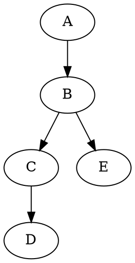
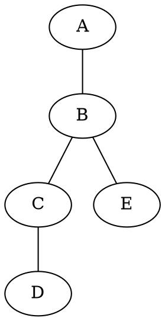
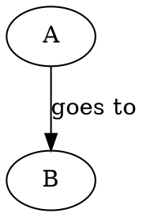
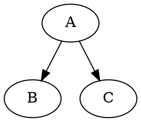
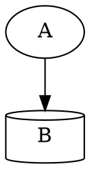
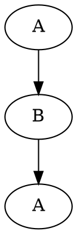
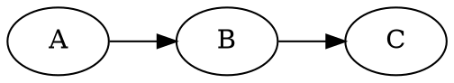

## Resources

- [Docs](https://graphviz.org/documentation/)

## Directed graph

## Undirected graph

## Edge labels

## Fork shorthand

The `{ }` is shorthand for describing a fork.

## Shapes

Full list of shapes: https://graphviz.org/doc/info/shapes.html

## Preventing cyclic dependencies

Consider a graph `A -> B -> A`. Normally the render engine will render a cyclic
graph with two nodes, `A` and `B`, where `A` points to `B` and `B` points back
to `A`.

What we want instead is an acyclic graph with three nodes, where two of the
nodes share the same name, `A`. To do so we can create two nodes with different
names but similar labels.

## Left-to-right direction

