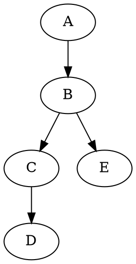
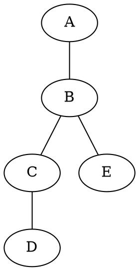
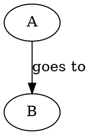
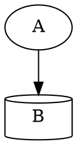
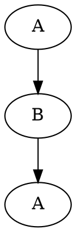

## Resources

- [Docs](https://graphviz.org/documentation/)

## Directed graph



## Undirected graph



## Edge labels



## Fork shorthand

The `{ }` is shorthand for describing a fork.

```dot
digraph G
    # Equivalent to:
    #   A -> B
    #   A -> C
    A -> {B C}
}
```

## Shapes

Full list of shapes: https://graphviz.org/doc/info/shapes.html



## Preventing cyclic dependencies

Consider a graph `A -> B -> A`. Normally the render engine will render a cyclic
graph with two nodes, `A` and `B`, where `A` points to `B` and `B` points back
to `A`.

What we want instead is an acyclic graph with three nodes, where two of the
nodes share the same name, `A`. To do so we can create two nodes with different
names but similar labels.


