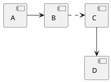

## Resources

- [PlantUML](https://plantuml.com/)
    - [Visualize JSON](https://plantuml.com/json)
    - [Sequence diagrams](https://plantuml.com/sequence-diagram)
    - [Component diagrams](https://plantuml.com/component-diagram)
- [Create diagrams with code using Graphviz](https://ncona.com/2020/06/create-diagrams-with-code-using-graphviz/)
- [Hitchhiker's Guide to PlantUML](https://crashedmind.github.io/PlantUMLHitchhikersGuide/)
- [PlantUML - real world examples](https://real-world-plantuml.com/)
- [Graphviz visual examples](https://renenyffenegger.ch/notes/tools/Graphviz/examples/index)

## Shapes

{}

Components have a shorthand: `[X]` is shorthand for `component X`.

## Tree

More information can be found at https://plantuml.com/creole (CTRL+F "tree").

{}

## Aliases

The `as` keyword defines aliases. This is useful if a component has a
long name and you plan on reusing the component in your diagram.

{}

## Links and arrows

Links between elements are made using combinations of dotted line (`..`),
straight line (`--`), and arrows (`-->`) symbols. 

Double dashes (or dots) orient the link vertically while a single dash orients the link horizontally.

## Arrow labels

Use `: <label>` as a suffix to add labels to arrows and relationships between objects.

{}

## Stereotypes or object annotations

Stereotypes can be thought of as an annotation within an object. It is
specified using `<<` and `>>`.

{}

## Notes

You can use the `note left of`, `note right of`, `note top of`, `note bottom
of` keywords to define notes related to a single object.

{}

## Grouping components

You can use several keywords to group components and interfaces together: package, node, folder, frame, cloud, database.

{}

## Colors

Colors can be applied using a variety of syntax. One method is
`<color:red>Text</color>`. See https://plantuml.com/color for more information.

{}
