## Resources

- [PlantUML](https://plantuml.com/)
    - [Visualize JSON](https://plantuml.com/json)
    - [Sequence diagrams](https://plantuml.com/sequence-diagram)
    - [Component diagrams](https://plantuml.com/component-diagram)
- [Create diagrams with code using Graphviz](https://ncona.com/2020/06/create-diagrams-with-code-using-graphviz/)
- [Hitchhiker's Guide to PlantUML](https://crashedmind.github.io/PlantUMLHitchhikersGuide/)
- [PlantUML - real world examples](https://real-world-plantuml.com/)
- [Graphviz visual examples](https://renenyffenegger.ch/notes/tools/Graphviz/examples/index)

## Component diagrams

### Shapes


<details><summary>Source</summary>

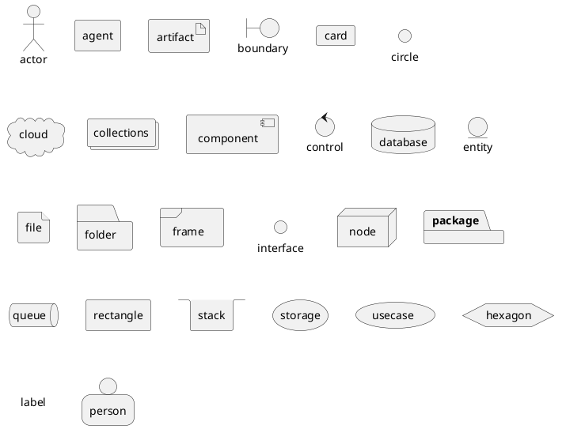

</details>

Components have a shorthand: `[X]` is shorthand for `component X`.

### Tree

More information can be found at https://plantuml.com/creole (CTRL+F "tree").


<details><summary>Source</summary>

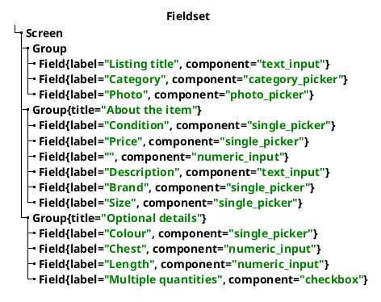

</details>

### Aliases

The `as` keyword defines aliases. This is useful if a component has a
long name and you plan on reusing the component in your diagram.


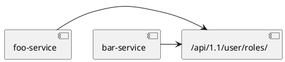

### Links and arrows

Links between elements are made using combinations of dotted line (`..`),
straight line (`--`), and arrows (`-->`) symbols. 

Double dashes (or dots) orient the link vertically while a single dash orients the link horizontally.


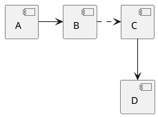

### Arrow labels

Use `: <label>` as a suffix to add labels to arrows and relationships between objects.


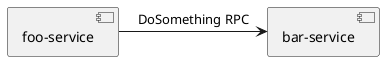

### Stereotypes or object annotations

Stereotypes can be thought of as an annotation within an object. It is
specified using `<<` and `>>`.


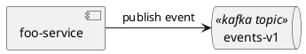

### Notes

You can use the `note left of`, `note right of`, `note top of`, `note bottom
of` keywords to define notes related to a single object.


```plantuml render
@startuml
note left of HTTP : Web Service only

note right of [First Component]
  A note can also
  be on several lines
end note

HTTP - [First Component]
@enduml
```

### Grouping components

You can use several keywords to group components and interfaces together: package, node, folder, frame, cloud, database.


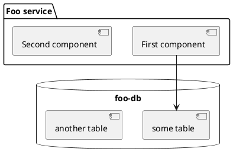

### Colors

Colors can be applied using a variety of syntax. One method is
`<color:red>Text</color>`. See https://plantuml.com/color for more information.


<details><summary>Source</summary>

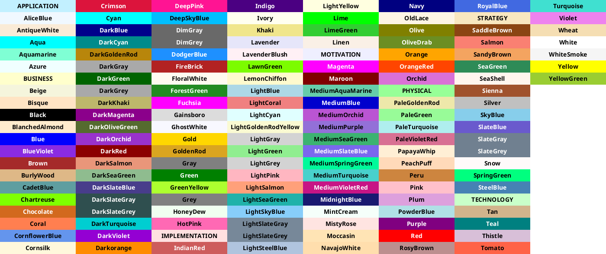

</details>

### Comments

```plantuml
@startuml
' This is a comment

/' This is a
block comment
'/
@enduml
```

### Emphasized text


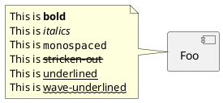

## Sequence diagrams

Documentation: https://plantuml.com/sequence-diagram

### Basic example

- `->` renders an arrow between participants.
- `-->` renders a dotted arrow. I like to use this to denote returns.
- `++` activates a bar on the target participant.
- `--` deactivates a bar on the source participant.
- `--++` can be used to mix activations and deactivations.
- `\n` can be used for multiline messages


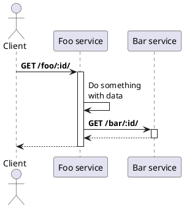

### Participants


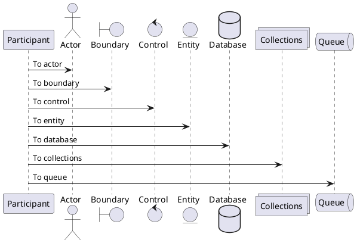

### Group participants


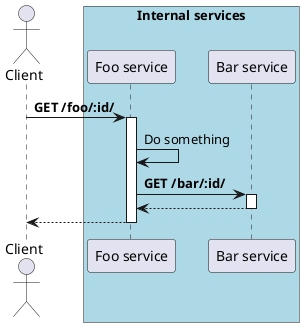

### Group part of the diagram


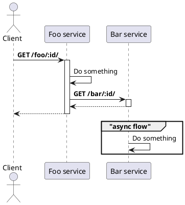

### Title, header, and footer


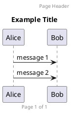

### Notes


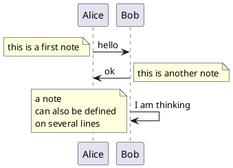

## CLI

### Make target to render diagrams

When adding documentation to a repo, I usually have the .plantuml files as
siblings to the documentation file. I'll then add the following to my
`Makefile`. I then generate diagrams using `make diagrams`. The
`-checkmetadata` flag will only render images where the source doesn't match
the previously-generated image.

```
diagrams:
    plantuml -metadata -checkmetadata -progress -tsvg ./docs/*.plantuml
```
